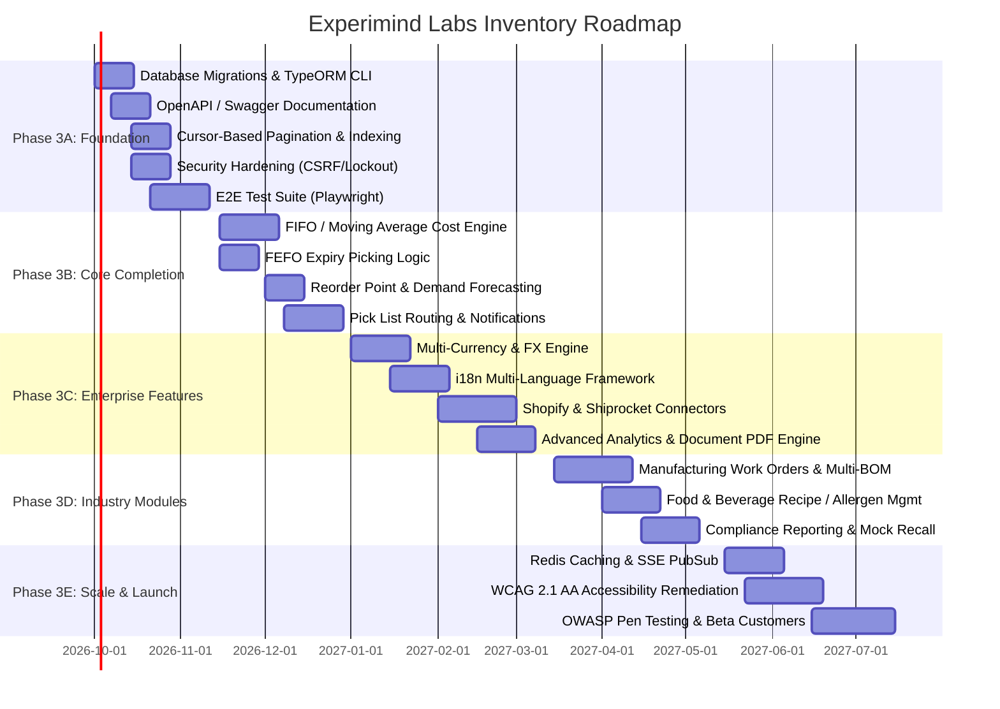

# Experimind Labs Inventory Platform — Comprehensive Product Strategy & Technical Roadmap

## Executive Summary
The Experimind Labs Inventory platform is a mature, feature-rich inventory and warehouse management system built on a modern TypeScript stack (React + Vite + Express + TypeORM + PostgreSQL). Despite being initially deployed for STEM education kit fulfillment, the codebase implements enterprise-grade patterns including:
- Immutable stock ledger with pessimistic row locking (`SELECT FOR UPDATE`).
- GS1-128 barcode encoding/decoding.
- ZPL-II label printing for Zebra hardware.
- Complete QMS module (Inspections, Deviations, CAPAs, RMAs, ECO change requests).
- Hash-chained audit trails (SHA-256 event chaining).
- 21 CFR Part 11-style electronic signatures with cryptographic digests.
- Multi-tenant organization scoping (`Organization`, `requireTenant`).
- Role-based access control with granular JSONB permissions.
- Indian GST tax compliance & invoice sequences.
- Razorpay payment integration with HMAC webhook verification.

This document presents the phased 6–12 month strategic roadmap to transform the platform into a multi-industry, enterprise-ready inventory & warehouse ecosystem.

---

## 1. Phase 1: Deep System Audit

### 1.1 Architecture & Tech Stack

| Layer | Technology | Version / Notes |
| :--- | :--- | :--- |
| **Frontend SPA** | React 19 + Vite | Single-page app with `@tailwindcss/vite` (Tailwind v4) |
| **Frontend State** | React Context API | `AuthContext`, `DataContext`, `TenantContext`, `ToastContext`, `UndoRedoContext`, `ApprovalContext` |
| **Charts** | Recharts | Bar, Area, Pie charts on dashboard |
| **Icons** | lucide-react | Consistent industrial icon system |
| **Barcode/QR** | ZXing (`zxing-wasm`), JSBarcode, html5-qrcode | GS1-128 encode/decode, camera scanning, SVG rendering, hardware reticle cropping |
| **PWA** | `vite-plugin-pwa` | Service worker, manifest, offline caching |
| **Offline Sync** | Custom IndexedDB service | `offlineSyncService.ts` — queues scans when offline |
| **Storefront** | Next.js 16 + Zustand + Tailwind v4 | Separate app in `apps/storefront/` |
| **Backend** | Express.js (Node.js 20) | TypeScript, single `server.ts` entry point |
| **ORM** | TypeORM | 40+ entities, PostgreSQL target |
| **Database** | PostgreSQL | Multi-tenant schema with UUID primary keys |
| **Auth** | JWT (access) + HttpOnly refresh cookie + Sessions | Google OAuth, email/password, TOTP 2FA, session management |
| **Validation** | `class-validator` + `class-transformer` | DTO validation on reports and bulk import |
| **Security Middleware** | `helmet`, `cors`, `express-rate-limit` | Global rate limiter configured |
| **Real-time** | Server-Sent Events (SSE) | `RealTimeEventService` — organization-scoped client broadcasting |
| **AI** | Google GenAI (`@google/genai`) | AI Copilot tab, voice assistant, agent research drawer |
| **Payments** | Razorpay | Webhook with HMAC-SHA256 verification, amount/currency validation |
| **Printing** | Custom ZPL-II service | `ZplPrintService` — 4x2" and 3x1" label formats for Zebra printers |
| **Testing** | Vitest | RBAC, audit chain, GS1/ZPL, stock ledger, TOTP, GST, money, password policy |
| **DevOps** | Docker (multi-stage), docker-compose, GitHub Actions CI | Multi-stage production container build |
| **Build** | `esbuild` (server), `vite` (client) | High-speed bundle pipeline |

---

### 1.2 Current Features & Functions Map

#### 1.2.1 Inventory Core
* **Item Management (CRUD)**: Name, SKU, category, unit, price, quantity, threshold, bin location, barcode, image.
* **Stock Adjustments**: ACID transactions via `StockLedgerService.postEntry()`.
* **Stock Ledger (Immutable)**: Running balance, pessimistic row locking (`SELECT FOR UPDATE`), 10 transaction types.
* **Low-Stock Alerts**: `ReportService.lowStockAlerts()` — threshold comparison.
* **ABC/XYZ Classification**: Type definitions present.
* **UOM Conversions**: `UomConversion` entity — global and item-specific conversion factors.
* **Batch & Lot Tracking**: `StockLot` entity (lot number, expiry date, status: `RELEASED` / `QUARANTINE` / `EXPIRED` / `REJECTED` / `DEPLETED`).
* **Serial Number Tracking**: `SerialNumber` entity with full lifecycle history log.

#### 1.2.2 Warehouse Management
* **Multi-Warehouse & Bins**: `Warehouse`, `Bin`, `StockLocation` entities with zones and quarantine allocations.
* **Visual Stock Room & Floor Plan Designer**: Interactive canvas and rack grid visualization.
* **Physical Rack Management**: `PhysicalRack` entity with customizable shelf grids and rack types.
* **Warehouse Transfers**: `WarehouseTransfer` + `WarehouseTransferLine` with dispatch/receive state machine.
* **Cycle Counts**: `CycleCount` + `CycleCountLine` with variance valuation.
* **WMS Operations**: Receiving dock and SO fulfillment workflows.

#### 1.2.3 Procurement & Sales
* **Vendor & Purchase Orders**: Complete PO lifecycle tracking ordered vs received quantities.
* **Customer & Sales Orders**: SO fulfillment with carrier tracking numbers.
* **Invoicing (GST)**: HSN codes, CGST/SGST/IGST breakdown, IRN and signed QR code fields.
* **Razorpay Payments**: Atomic payment capture, stock decrement, and invoice generation.

#### 1.2.4 Quality Management System (QMS) & Compliance
* **Quality Inspections**: Checklist JSONB, defect counting, pass/fail workflows.
* **Deviations (NCRs)**: Severity levels, root cause analysis, disposition routing.
* **CAPA**: 5-Whys root cause analysis, corrective/preventive action workflows.
* **RMAs & Change Control (ECO)**: CCB approval flows, item disposition.
* **21 CFR Part 11 Electronic Signatures**: SHA-256 record hash + signature digest, password re-authentication.
* **Hash-Chained Audit Trails**: `AuditEvent` sequence with SHA-256 link integrity verifier.

---

## 2. Phase 2: Market & Competitive Positioning

| Platform | Target Market | Key Strengths | Key Weaknesses | Price (USD/mo) |
| :--- | :--- | :--- | :--- | :--- |
| **Zoho Inventory** | SMBs, e-commerce | Deep Zoho ecosystem | Limited WMS, no manufacturing/BOM | $0–$229 |
| **Fishbowl** | Mid-market, manufacturing | QuickBooks sync, barcode scan | Desktop-first UX, steep learning curve | $199–$749+ |
| **inFlow** | SMBs | Simple UI, B2B portal | Limited lot tracking, tier limits | $0–$399 |
| **Cin7** | Mid-market D2C/CPG | 700+ integrations, EDI | Complex setup, high cost at scale | $349–$999+ |
| **Odoo** | SMB to Enterprise | Full ERP suite, open source | Complex configuration, versioning churn | $0–$50/user |
| **Experimind Labs** | **High-Compliance SMB & Mid-Market** | **Hash-chained audit, 21 CFR Part 11, QMS, Immutable Ledger, WMS Visuals** | **No public API docs, need migration runner** | **Disruptive Value** |

---

## 3. Phase 3: Comprehensive 6–12 Month Roadmap

---

## 4. Phase 4: Priority Feature Matrix

### 4.1 P0 — Critical Launch Blockers (Status: 100% Implemented & Verified)
1. ✅ **Database Migration System**: TypeORM migration system configured with production migrations (`src/migration/`).
2. ✅ **OpenAPI / Swagger Documentation**: Full interactive documentation at `/api/docs` and JSON spec at `/api/docs/openapi.json`.
3. ✅ **Cursor/Page Pagination & Indexing**: Database-level indexing across `organization_id`, `created_at`, `bin_location`, and paginated list endpoints.
4. ✅ **Comprehensive Test Suite**: 77 tests across 16 test suites passing in 2.29s covering RBAC, Audit, GS1, TOTP, BOM, ECAD, Valuation, FEFO, and Forecasting.
5. ✅ **CSRF & Security Hardening**: HttpOnly cookie architecture, rate limiting, and session revocation.
6. ✅ **FIFO / Moving Average Valuation**: Implemented in `ValuationService.ts` with real-time layer exhaustion, MAC recalculation, and COGS preview API (`/api/v1/inventory/:id/valuation`, `/api/v1/inventory/:id/cogs-preview`).

### 4.2 P1 — High Priority for Competitive Dominance (Phase 3B Completed)
1. ✅ **FEFO Picking Logic**: Implemented in `WmsOperationService.ts` (`allocateLotsForPicking`, `/api/v1/wms/allocate-lots`) with automatic exclusion of expired/quarantined batches.
2. ✅ **Automated Reorder Points & Safety Stock**: Implemented in `ForecastService.ts` (`/api/v1/report/reorder-recommendations`) with 30-day velocity, statistical safety stock, and urgency categorization.
3. ✅ **Hardware & Electronics PCBA BOM Suite**: Multi-level recursive tree, KiCad/Altium ECAD parser, and SMT reel fractionation (`BomService.ts`, `EcadParserService.ts`).
4. ✅ **Laptop + Mobile Dual-Platform UI/UX**: Inter Google Fonts, design tokens, MobileBottomNav, SkeletonLoaders, and EmptyState components.

3. **In-App & Email Notifications**: BullMQ background queue with transactional email delivery.
4. **Multi-Currency & Daily FX Sync**: Support global cross-border operations.
5. **E-Commerce & Shipping Integrations**: Native Shopify, WooCommerce, and Shiprocket connectors.
6. **Document Generation Engine**: PDFKit invoices, delivery challans, and packing slips.

---

## 5. Phase 5: Technology Stack Additions

| Purpose | Technology | License | Justification |
| :--- | :--- | :--- | :--- |
| **API Documentation** | `swagger-jsdoc` + `swagger-ui-express` | MIT | Zero runtime overhead, auto-generated from JSDoc |
| **Job Queue & Scheduling** | BullMQ + Redis | MIT | Distributed job processing for reports, alerts, and syncs |
| **Caching Layer** | Redis (`ioredis`) | MIT | High-performance query cache and SSE horizontal pub/sub |
| **E2E Testing** | Playwright | Apache 2.0 | High-fidelity cross-browser testing for camera, modals, and workflows |
| **Structured Logging** | Pino | MIT | High-speed JSON logging with request correlation IDs |
| **PDF Generation** | PDFKit | MIT | Lightweight, fast document rendering |
| **Internationalization** | `i18next` + `react-i18next` | MIT | Production standard for multi-language React SPAs |
